# liderapi - Fonksiyon Seviyesi Yetkilendirme Açığı ve Düzeltmesi (CWE-862)

<p align="center">
  <b>TEKNOFEST 2026 - Pardus Hata Yakalama ve Öneri Yarışması</b><br>
  <b>Takım: DUSAR</b> &nbsp;|&nbsp; Kategori: Geliştirme &nbsp;|&nbsp; Hedef: LiderAhenk Merkezi Yönetim Sistemi / liderapi
</p>

<p align="center">
  
  
  
  
</p>

---

## Özet

liderapi (LiderAhenk sunucu API'si) kullanıcı denetleyicisi (`UserController`) **fonksiyon seviyesinde yetkilendirme içermiyor**. Kimliği doğrulanmış, sınırlı rollü bir konsol operatörü (`liderPrivilege = ROLE_USER + ROLE_AGENT_INFO`), kullanıcı-yönetimi rolü (`ROLE_USERS`) veya admin (`ROLE_ADMIN`) verilmemiş olsa bile, `/api/lider/user/update-user-password` ucuna geçerli JWT'siyle istek atarak **domain admin dahil herhangi bir kullanıcının parolasını sıfırlayabiliyor** ve ardından admin hesabına geçerek merkezi yönetim otoritesini devralıyor.

Bu depo, DUSAR ekibinin bu açık için geliştirdiği **düzeltmeyi** ve bulgunun **kanıtlarını** (kaynak-kod, canlı PoC ve adli-bilişim ekran görüntüleri) içerir.

| | |
|---|---|
| **Zafiyet sınıfı** | CWE-862 Missing Authorization (MITRE 2024 CWE Top 25) + CWE-639 (IDOR/BOLA) + net etki CWE-269 (privilege escalation) |
| **OWASP** | API5:2023 Broken Function Level Authorization (BFLA) |
| **Etkilenen sürümler** | Yayımlı TÜM sürümler (3.0.0 - 3.3.1, commit `6e2bbd2`) |
| **Düzeltme durumu** | Yalnızca etiketlenmemiş `master` HEAD'de (`5a96be0`); hiçbir yayımlı sürümde yok |

---

## 1. Açık - Kaynak Kod Kanıtı (yayımlı 3.3.1, commit `6e2bbd2`)

Taze klon üzerinde, kullanıcı denetleyicisinde hiçbir rol/yetki anotasyonu bulunmuyor. `grep -c "Secured|PreAuthorize|hasRole|hasAuthority"` sonucu **0**:

<p align="center">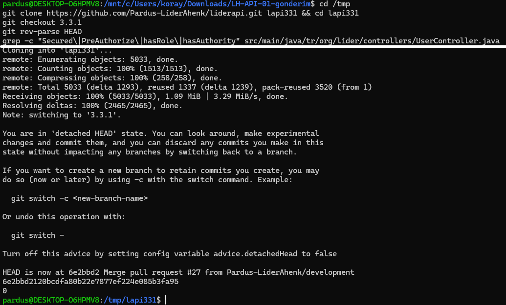</p>

`UserController` sınıf başlığı (L57-60): `@Secured` / `@PreAuthorize` **yok**.

<p align="center">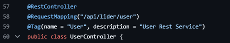</p>

HTTP güvenlik yapılandırması bu yolu yalnız **kimliğe** bağlıyor, role değil (`.anyRequest().authenticated()`):

<p align="center">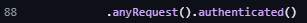</p>

Metot seviyesi güvenlik de kapalı: `@EnableGlobalMethodSecurity(prePostEnabled = true)` yalnız `@PreAuthorize`'ı etkinleştirir; `@Secured` için gereken `securedEnabled = true` **yok**:

<p align="center">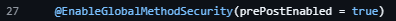</p>

Parola sıfırlama gövdesi (L430-434) hedef DN'yi doğrudan istekten alıyor; "çağıran == hedef mi" ya da "çağıran yetkili mi" denetimi **yok**:

<p align="center">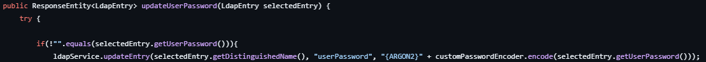</p>

### Tehdit modeli (dürüstçe)

Girişe yalnız konsol operatörleri kabul edilir (`UserService` L46, LDAP filtresi `liderPrivilege=ROLE_USER`). `ROLE_USER` yalnızca "konsola giriş" yetkisidir, kullanıcı-yönetimi yetkisi değildir:

<p align="center">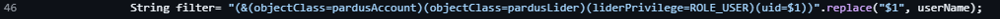</p>

liderapi LDAP'a **oturum açan operatörün kendi kimliğiyle** bağlanır (servis hesabıyla değil):

<p align="center">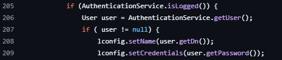</p>

Kurulum ACL'i `userPassword` yazımını yalnız `adminGroups` üyelerine (ve self'e) verir (kural {0}):

<p align="center">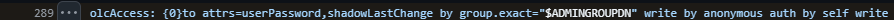</p>

<p align="center">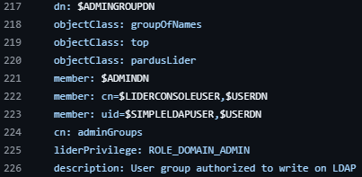</p>

> **Not (dürüst nüans):** Sömürülebilir operatör `adminGroups` üyesidir; kırılan şey, operatörleri **rollerine** göre ayırması gereken **konsol (liderapi) fonksiyon-seviyesi yetkilendirmesidir**. Bu kontrol yayımlı tüm sürümlerde tümüyle yoktur.

---

## 2. Canlı PoC - Sonucun Kanıtı

İki ayrı makine, ağ üzerinden. Düşük rollü operatörün `./exploit.sh` isteği **HTTP 200** dönüyor ve admin parolası `{ARGON2}` hash'iyle eziliyor:

<p align="center">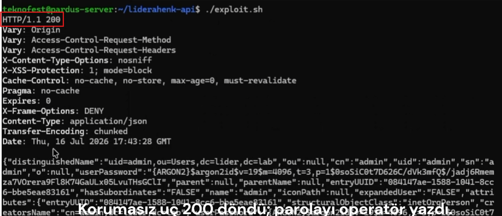</p>

**Can alıcı kanıt:** dizinin KENDİ denetim kaydı. Admin girdisinde `modifiersName = uid=operator` - yani admin parolasını gerçekten düşük rollü operatör yazmış (bu alan istekle gönderilmez, dizin üretir):

<p align="center">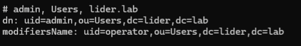</p>

Operatörün gerçekten düşük yetkili olduğunun ve ortamın ayakta olduğunun kanıtı: `docker compose ps` (üç konteyner Up) ve operatör `ldapsearch` çıktısında yalnız `ROLE_USER + ROLE_AGENT_INFO` (ne `ROLE_USERS` ne `ROLE_ADMIN`):

<p align="center">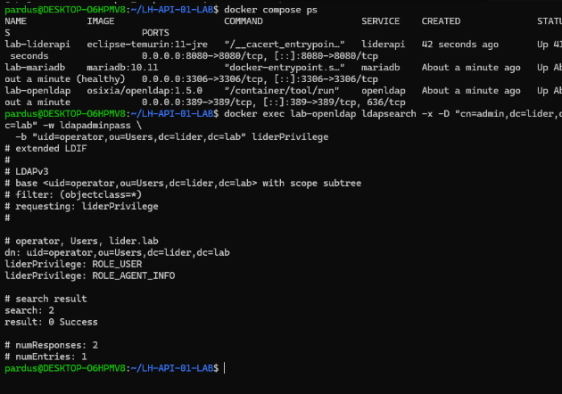</p>

### PoC Videosu (4:25)

İki makineli, uçtan uca canlı sömürünün düzenlenmiş ekran kaydı (altyazı ve yakınlaştırma eklenmiş). Dosya boyutu GitHub'ın tek-dosya sınırı (100 MB) üzerinde olduğundan **[Releases](https://github.com/itsc0c0/dusar-liderapifix/releases)** bölümünden erişilebilir.

---

## 3. Düzeltme (DUSAR)

Düzeltme iki katmanı birden kapatır. `UserController`'a sınıf seviyesinde `@Secured` **ve** parola sıfırlamaya **nesne seviyesinde** sahiplik/yetki kontrolü (yetkisizse `HTTP 403`) eklenir:

<p align="center">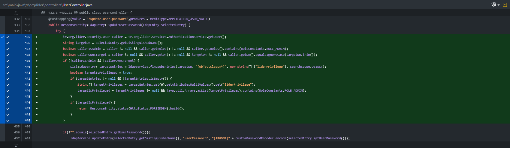</p>

Tamamlayıcı olarak koda gömülü sabit `jwt.secret` ortam değişkenine taşınır:

<p align="center">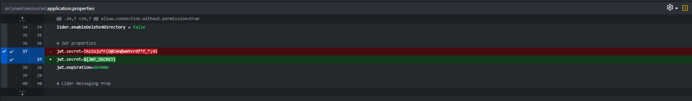</p>

Bu yaklaşım satıcının kendi (yayımlanmamış) `master` düzeltmesiyle de doğrulanır: `5a96be0`'da `securedEnabled = true` açılmış ve `UserController`'a `@Secured({ROLE_ADMIN, ROLE_USERS})` eklenmiştir. Yani DUSAR düzeltmesi hem satıcı yönünü yayımlı hatta taşır hem de nesne-seviyesi kontrolle riski tümden kapatır:

<p align="center">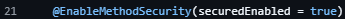</p>

### Önerilen düzeltme adımları

1. `WebSecurityConfig`: metot güvenliğini gerçekten aç -> `@EnableMethodSecurity(securedEnabled = true)`.
2. `UserController`: sınıfa `@Secured({RoleConstants.ROLE_ADMIN, RoleConstants.ROLE_USERS})` ekle ve yayımlı 3.x hattına backport et.
3. `updateUserPassword` (ve `delete-user` / `edit-user`): nesne seviyesinde kontrol; çağıran, hedef DN'nin sahibi değilse ve yetkili yönetici değilse `HTTP 403`.
4. `application.properties`: koda gömülü `jwt.secret` yerine `jwt.secret=${JWT_SECRET}`.

### Bu depodaki değişen dosyalar

| Dosya | Değişiklik |
|---|---|
| [`UserController.java`](UserController.java) | Sınıf seviyesi `@Secured` + `updateUserPassword` içinde nesne seviyesi 403 kontrolü |
| [`application.properties`](application.properties) | `jwt.secret=${JWT_SECRET}` (koda gömülü sabit kaldırıldı) |

---

## Kurulum (fork - Java 21, Maven 3.6+)

```bash
git clone https://github.com/itsc0c0/dusar-liderapifix.git
cd dusar-liderapifix
mvn clean package
```

Frontend (liderui) ile birlikte derleme için: `mvn clean package -P build-with-vue` (liderui build çıktısının liderapi ile aynı üst dizinde olması gerekir). Üst proje: [Pardus-LiderAhenk/liderapi](https://github.com/Pardus-LiderAhenk/liderapi).

---

## Sorumlu İfşa

Bu depo, TEKNOFEST 2026 Pardus Hata Yakalama ve Öneri Yarışması kapsamında, Pardus/LiderAhenk yazılımlarının güvenliğine ve geliştirilmesine katkı amacıyla hazırlanmıştır. İçerik yalnızca yarışma değerlendirmesi ve savunma amaçlıdır; kötü niyetli kullanım hedeflenmemiştir.

<p align="center"><b>Takım DUSAR</b> - TEKNOFEST 2026</p>
